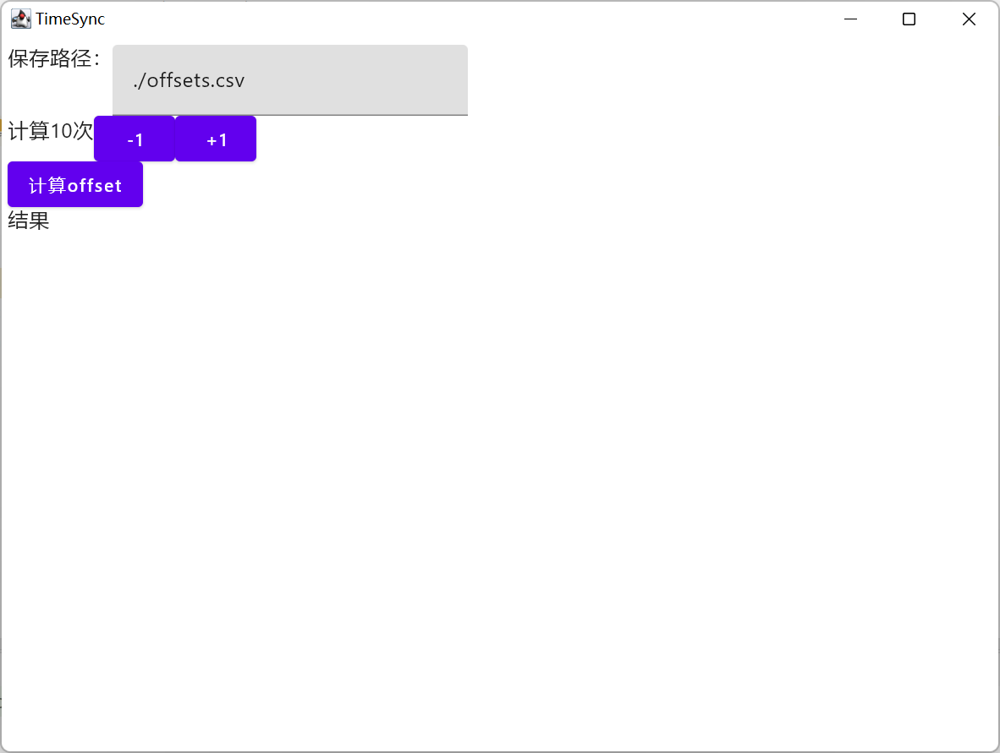
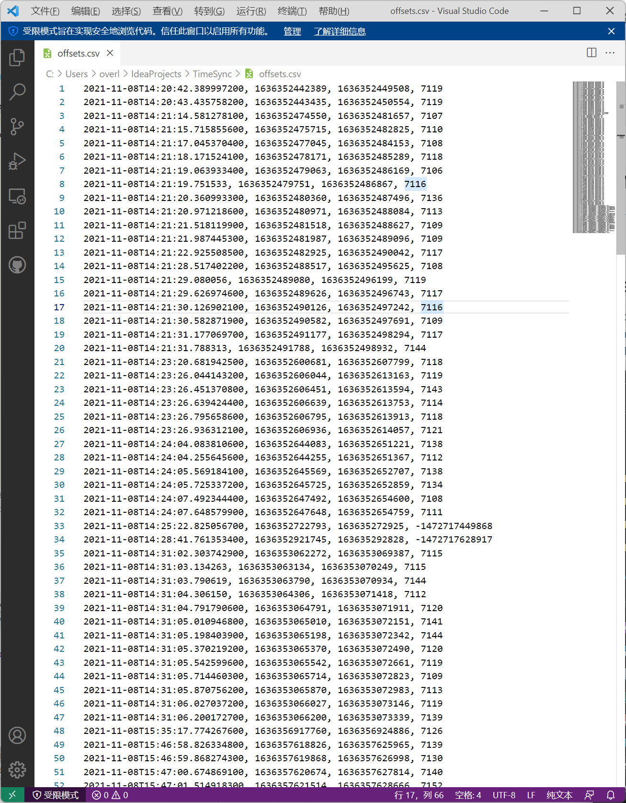

# TimeSync

A super tiny tool for syncing times between a local computer and android devices, through [adb tool](https://developer.android.com/studio/command-line/adb)

## Screen Shots

It uses compose lib and Kotlin, with a trivial UI, supporting basic functions, setting data-saving files, time-offset estimating count and start calculating. Keeping it easy and simple is the point.

## Data Format

it looks like this below:

1. The 1st col is the header, the time we write this entry into the csv file.
2. The 2nd col is the time of the local computer.
3. The 3rd col is the remote time of android devices
4. The last one is the time offset, means (remote times - local times)

Additionally, the system counts the time offset by averaging the data at 10 times.
It fits almost every situation, but you can modify it through `+1` and `-1` button.

## Features supported

- [x] calculating time offset with a computer and an android device
- [ ] with a chosen dialog to choose multiple android devices
- [ ] an auto-refresh feature may be supported, once a phone plugged in, once the time offset is calculated.
- [ ] integrated with IMU-data formatter.